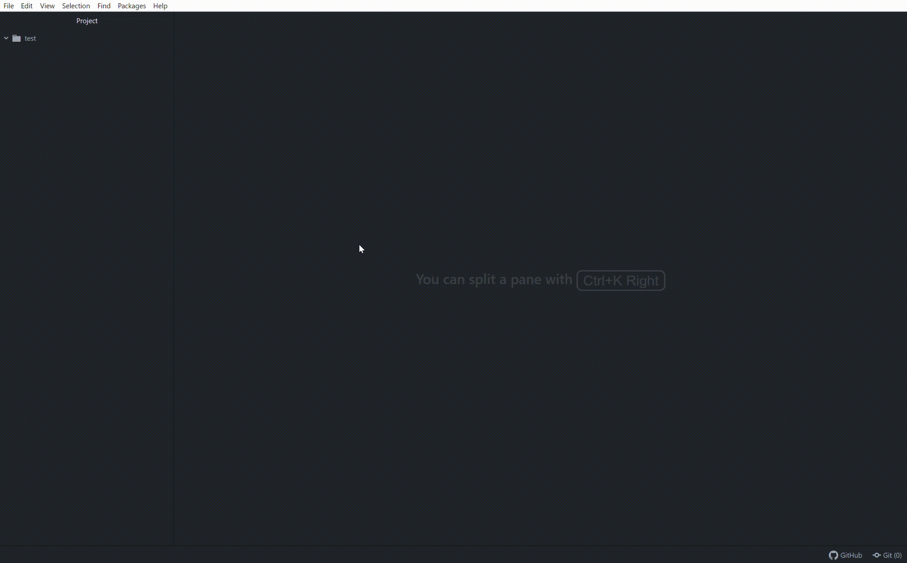

### Création automatique des Commentaires pour les Cours - v2.0.0

Ajoute un boiler plate code avec tous les commentaires à mettre (CONSTANTES, ATTRIBUTS, etc.) et ajoute un en-tête avec les informations comme la classe, l'auteur, etc.

#### Visual Studio Code
La version Visual Studio Code inclus : 
- Le champ "**Date**" se rempli automatiquement
- L'extension change elle-même la syntaxe des commentaires pour s'adapter au langage utilisé.

#### Atom
La version Atom n'a pas les avantages de la version pour Visual Studio Code ci-dessus.

## Features

### Visual Studio Code
Le code boiler plate s'adapte automatiquement au langage que vous utilisez !
Et la date se complète automatiquement, selon la date de votre PC.

### Atom
Le code boiler plate n'est uniquement utilisable avec :
- Java

## Requirements

Cette extension est disponible pour les éditeurs suivants:
- [x] Visual Studio Code
- [x] Atom

## Installation

### Visual Studio Code
Pour installer cette extension, [téléchargez le zip de la dernière release](https://github.com/Ttiki/ccc-0.0.1/releases), dézippez le et déposez-le dans le dossier :
**<user>.vscode\extensions**
Relancez Visual Studio Code. Pour créer le code boiler plate, écrivez juste `ccc`, une autosuggestion vscode _ccc_ vas apparaître, appuyez sur entrée et c'est tout.
  
### Atom 
Pour installer cette extension, [téléchargez le zip de la dernière release](https://github.com/Ttiki/ccc-0.0.1/releases), dézippez le et déposez-le dans le dossier :
**<user>.atom\packages**
Relancez Atom. Pour créer le code boiler plate, écrivez juste `ccc`, une autosuggestion vscode _ccc_ vas apparaître, appuyez sur entrée et c'est tout.

## Release Notes

### 2.0.0

L'extension pour Atom est maintenant disponible

### 1.0.0

Ajoute un boiler plate code avec tous les commentaires à mettre (CONSTANTES, ATTRIBUTS, etc.) et ajoute un en-tête avec les informations comme la classe, l'auteur, etc.
S'adapte au langage utilisé (pour les commentaires).
