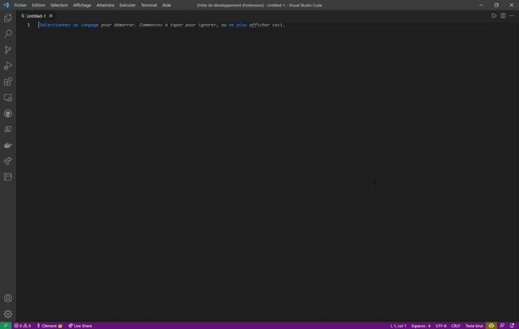

# Création automatique des Commentaires pour les Cours (ccc)

Cette extension permet d'automatiquement créer un code boiler plate avec tous les commentaires à mettre pour les codes (notamment java) pour les cours. Installer l'installation et tapez ccc, une autosuggestion devrait apparaître, appuyez sur entrée, le code boiler plate apparaît !

## Features

Le code boiler plate s'adapte automatiquement au langage que vous utilisez !

Et la date se complète automatiquement, selon la date de votre PC.

## Requirements

Cette extesnion est disponible pour les éditeurs suivants:
- [x] Visual Studio Code
- [x] Atom

#### Installation
Pour installer cette extension Visual Studio Code, téléchargez le zip ci-dessous, dézippez le et déposez-le dans le dossier :
**<user>.vscode\extensions**
Relancez Visual Studio Code. Pour créer le code boiler plate, écrivez juste `ccc`, une autosuggestion vscode _ccc_ vas apparaître, appuyez sur entrée et c'est tout.

## Release Notes

### 2.1.0

Nouveaux commentaires disponibles et quelques fixes des anciens commentaires.

### 2.0.0

L'extension pour Atom est maintenant disponible

### 1.0.0

Ajoute un boiler plate code avec tous les commentaires à mettre (CONSTANTES, ATTRIBUTS, etc.) et ajoute un en-tête avec les informations comme la classe, l'auteur, etc.
S'adapte au langage utilisé (pour les commentaires).

# Change Log

All notable changes to the "ccc" extension will be documented in this file.

## [Unreleased]

## [2.0.0] - 2022-02-01
### Added
- Atom extension

### Removed
- Auto date pour l'extension Atom uniquement

## [1.0.0] - 2022-02-01
### Added
- Code suggestion
- Boiler plate code
- Default comments
- Auto date fill